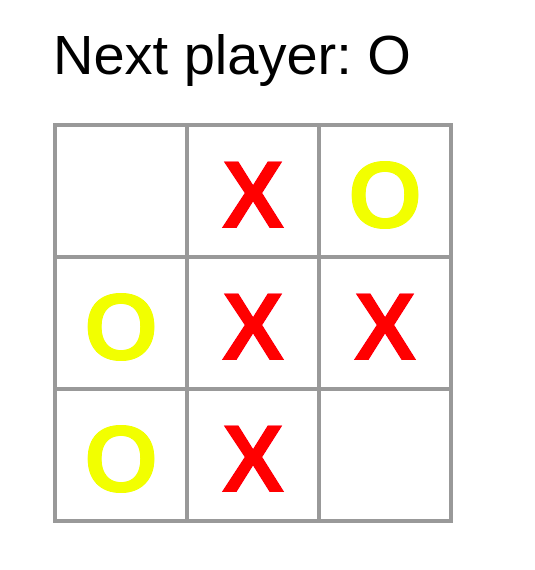

# tic-tac-toe-react

A simple project, aimed at learning the main concepts of the React.js library.

This code is part of the [React introduction tutorial](https://pt-br.reactjs.org/tutorial/tutorial.html). I just separated the components into files (for better code organization) and colored the players: red for "X" and yellow for "O".

Unfortunately, with this change, the application loses the ability to define a winner, as the respective function needs strings in the squares, and I replaced it with DOM components in order to color them.

Demonstration:

